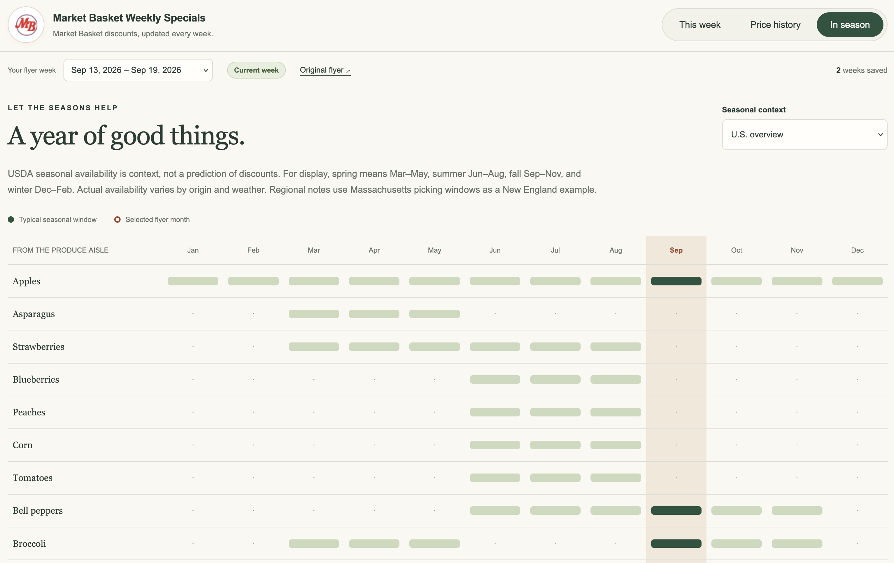
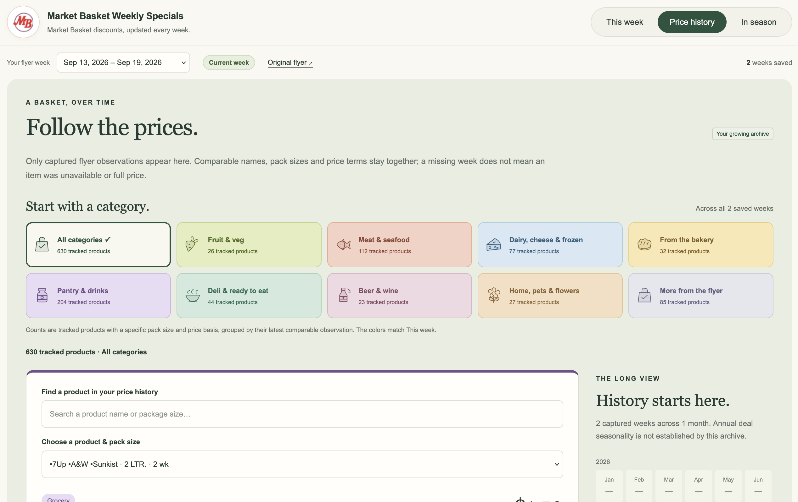
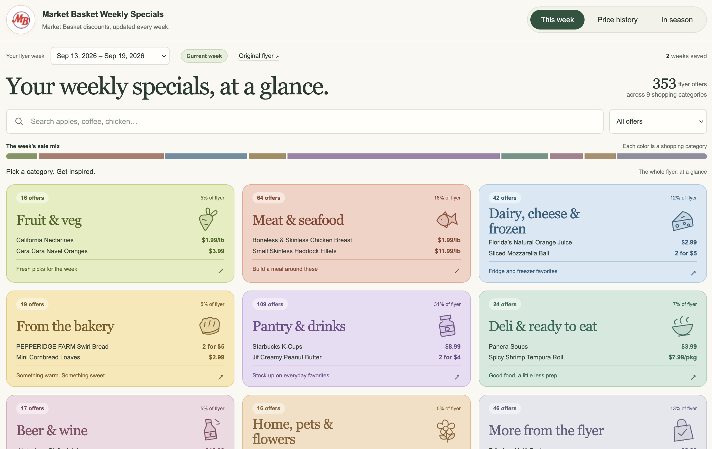

# Market Basket Weekly Specials

[Open the live website](https://lofihippo.github.io/Market-Basket-Checker/) ·
[Automatic update status](https://github.com/lofihippo/Market-Basket-Checker/actions/workflows/weekly-specials.yml)

Market Basket discounts, updated every week. This tool downloads the official
weekly flyer PDF and turns it into a colorful, searchable report with shopping
categories, price history, and a U.S. seasonal produce guide with New England notes.

Use the live site above, run it locally, or host your own copy with GitHub Pages.
The report works in a browser; Python handles downloads and updates.

## Screenshots

Click a preview to enlarge.

| In season | Price history | This week |
| --- | --- | --- |
| <a href="docs/screenshots/in-season.png"></a> | <a href="docs/screenshots/price-history.png"></a> | <a href="docs/screenshots/this-week.png"></a> |

## Install

Use Python 3.14 (the version used by the GitHub workflow) and Git. On macOS or Linux:

```bash
git clone https://github.com/lofihippo/Market-Basket-Checker.git
cd Market-Basket-Checker
python3 -m venv .venv
source .venv/bin/activate
python -m pip install -r requirements.txt
```

## Run locally

```bash
python scripts/check_weekly.py
```

Open `output/report.html` in your browser. Run the command again to check for
updates and add new weeks to the price history. No API keys or AI services are needed.

Generated reports, the SQLite history database, and source archives live in
`output/`, which Git ignores. Keep that folder to retain your local history.
See the [command reference](docs/REFERENCE.md) for offline PDFs, backups, and
rebuilding reports. For automatic local updates, use the
[macOS scheduler](docs/REFERENCE.md#scheduled-checks-on-macos).

## Deploy with GitHub Pages

The live site updates **Sunday at 5 PM Eastern**, with a **Monday 9:15 AM Eastern**
follow-up. GitHub Actions downloads the flyer, saves history on the `weekly-history`
branch, and publishes the report. Scheduled runs can be delayed by GitHub.

To host your own copy:

1. Fork this repo to a **personal, public repository**.
2. Replace `lofihippo/Market-Basket-Checker` in the workflow's repository guards
   (both jobs and artifact cleanup) with your own `username/repository`.
3. Enable Actions, then set **Settings → Pages → Source → GitHub Actions**.
4. Open **Actions → Update weekly specials → Run workflow** on `main`.

This setup uses free public GitHub Pages and standard public-repository Actions
runners, with storage limits and artifact cleanup. The workflow is scoped to the
named personal repository; it does not change organization settings.
See [deployment setup, safeguards, and troubleshooting](docs/GITHUB_PAGES.md)
for the full instructions.

## Self-host

After running the checker, export a static site and preview it locally:

```bash
python scripts/publish_site.py site --directory output/site
python -m http.server 8766 --bind 127.0.0.1 --directory output/site
```

Open [localhost:8766](http://127.0.0.1:8766/), or copy the entire `output/site/`
folder to a static web server. Run the checker and export again to refresh it.
The export includes the source PDFs for offline use.

## More details

- [How it works](docs/HOW_IT_WORKS.md) — extraction, categories, history, data fields, and limitations.
- [Command reference](docs/REFERENCE.md) — advanced options, scheduling, backups, and development checks.
- [Running options](docs/RUNNING_OPTIONS.md) — shared website, personal fork, and local use.

This is an independent project. PDF extraction can miss or misread offers;
review flagged items and confirm details against the original flyer.
